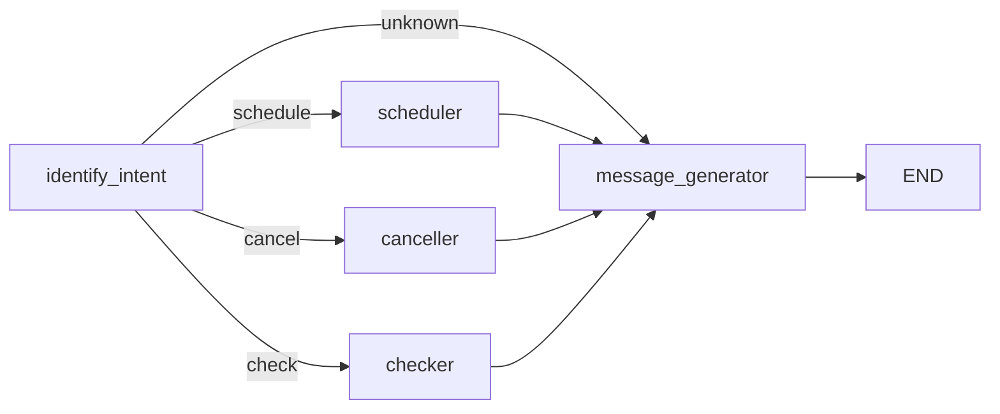

# Medical Appointment Agent

[](https://github.com/italoo97/medical_agent/actions/workflows/ci.yml)
[](https://www.python.org/)
[](https://www.langchain.com/langgraph)

A conversational agent that schedules, cancels, and looks up medical appointments on behalf of a patient, backed by **real Google Calendars** (one calendar per professional) instead of an in-memory or hardcoded roster.

The agent understands free-form natural language ("I want to see a cardiologist next Monday at 4pm"), but every decision that actually touches a calendar — availability, booking, cancellation — is made by plain, testable Python code. The LLM's only job is to translate between natural language and structured data; it never decides anything on its own.

## Contents

- [How it works](#how-it-works)
- [Tech stack](#tech-stack)
- [Project structure](#project-structure)
- [Setup](#setup)
- [Running the agent](#running-the-agent)
- [API reference](#api-reference)
- [Development](#development)
- [Design principles](#design-principles)
- [Known limitations](#known-limitations)

## How it works

Every message is processed by a small [LangGraph](https://www.langchain.com/langgraph) state machine:



1. **`identify_intent`** — an LLM call (via OpenRouter) extracts structured data from the patient's message: intent (`schedule`, `cancel`, `check`, or `unknown`), professional name/specialty, patient name, date, time, and reason. The current professional roster is fed into this prompt so the model can resolve nicknames, typos, or partial names to the exact registered professional, instead of the application guessing.
2. **`scheduler` / `canceller` / `checker`** — plain Python nodes that validate the extracted data and talk to Google Calendar through `AppointmentService`. They never call the LLM. Cancelling doesn't require an exact date/time: if the patient doesn't remember it, the agent looks up their next upcoming appointment (scoped to the named professional, when given, so it never surfaces or touches another professional's appointment).
3. **`message_generator`** — a second LLM call turns the outcome (success, or a specific failure reason) into a short, friendly reply in the same language the patient used.

Professionals are **discovered dynamically**: `AppointmentService.list_professionals()` reads whichever Google Calendars have been shared with the service account, so adding a professional is an operational action (share a calendar + one API call — see [API reference](#api-reference)), never a code change or a redeploy.

## Tech stack

| Concern | Choice |
|---|---|
| Agent orchestration | [LangGraph](https://www.langchain.com/langgraph) |
| LLM provider | [OpenRouter](https://openrouter.ai/) (free-tier models by default) |
| Calendar backend | [Google Calendar API](https://developers.google.com/calendar/api) via a service account |
| HTTP server | [FastAPI](https://fastapi.tiangolo.com/) + Uvicorn |
| Validation | [Pydantic](https://docs.pydantic.dev/) / pydantic-settings |
| Observability | [LangSmith](https://www.langchain.com/langsmith) tracing (optional) |
| Testing | pytest, with a fully in-memory `FakeCalendarClient` — no real network calls in the test suite |
| Linting / types | Ruff + mypy (strict) |

## Project structure

```
src/medical_agent/
├── main.py                    # entry point: FastAPI app (/chat, /admin) and CLI mode
├── core/config.py              # Settings (pydantic-settings), read from .env
├── exceptions.py                # GatewayError / UpstreamProviderError
├── schemas/chat.py              # ChatRequest / ChatResponse (HTTP contracts)
├── graph/
│   ├── factory.py               # builds and compiles the StateGraph
│   ├── routing.py                # routes on the extracted intent
│   ├── state.py                  # AppointmentState (TypedDict)
│   └── nodes/                     # identify_intent, scheduler, canceller, checker, message_generator
├── prompts/v1/                   # prompt-building code
│   ├── templates/*.md             # the actual prompt text lives here, not in .py files
│   └── _loader.py                  # parses `### section` headers out of the .md files
└── services/
    ├── calendar_client.py           # CalendarClient Protocol + Professional
    ├── google_calendar_client.py     # real implementation (Google Calendar API)
    ├── fake_calendar_client.py        # in-memory implementation, used only in tests
    ├── appointment_service.py         # business logic: booking, cancelling, lookups
    └── llm.py                          # OpenRouterService (LangSmith-traced)
tests/                            # unit tests, one FakeCalendarClient, no real API calls
```

Every service is injected as a dependency (`AppointmentService` takes a `CalendarClient`, node factories take an `AppointmentService`/`BaseLLMService`), so the graph, the HTTP app, and the tests can all be assembled with different implementations without touching the business logic.

## Setup

### Prerequisites

- Python 3.13+
- [Poetry](https://python-poetry.org/)
- An [OpenRouter](https://openrouter.ai/) API key
- A Google Cloud project with the Calendar API enabled

### 1. Install dependencies

```bash
poetry install
```

### 2. Create a Google Calendar service account

1. In the [Google Cloud Console](https://console.cloud.google.com/), create (or reuse) a project and enable the **Google Calendar API** for it.
2. Create a **service account** and generate a JSON key for it.
3. For each professional, share their Google Calendar with the service account's email (found in the JSON key as `client_email`), with **"Make changes to events"** permission or higher. Viewer-only access is not enough — the agent needs to create and delete events.
4. Sharing alone does **not** make the calendar show up for the service account — see the note in [API reference](#api-reference) about registering it.

### 3. Configure environment variables

Copy `.env.example` to `.env` and fill in the values:

```bash
cp .env.example .env
```

| Variable | Required | Purpose |
|---|---|---|
| `OPENROUTER_API_KEY` | yes | Authenticates calls to OpenRouter |
| `GOOGLE_SERVICE_ACCOUNT_JSON` | yes | The full service account key, as one line of JSON |
| `ADMIN_API_KEY` | yes | Protects the `/admin/professionals/*` endpoints (generate with `openssl rand -hex 32`) |
| `LANGSMITH_TRACING` | no | Set to `true` to enable tracing |
| `LANGSMITH_API_KEY` | no | Required only if tracing is enabled |
| `LANGSMITH_PROJECT` | no | LangSmith project name for traces |

The model list, temperature, timezone (default `America/Sao_Paulo`) and a few other defaults live in `src/medical_agent/core/config.py` rather than in `.env` — adjust them there if needed.

## Running the agent

Short commands are wired up via [taskipy](https://github.com/taskipy/taskipy):

```bash
poetry run task server   # FastAPI server on http://0.0.0.0:8000, exposing POST /chat
poetry run task cli      # talk to the agent directly in the terminal
```

## API reference

### `POST /chat`

```bash
curl -X POST http://localhost:8000/chat \
  -H 'Content-Type: application/json' \
  -d '{"question": "I am Maria Santos, I want to see a cardiologist next Monday at 4pm"}'
```

Returns the natural-language reply alongside structured fields describing what the agent actually did, useful for a UI or an automated client that shouldn't have to parse prose:

```json
{
  "model": "medical-agent",
  "content": "Your appointment with Dr. John Doe is confirmed for Monday at 16:00. See you then!",
  "intent": "schedule",
  "error": null,
  "calendar_id": "c_xxxx@group.calendar.google.com",
  "appointment_datetime": "2026-09-07T16:00:00-03:00"
}
```

### `POST /admin/professionals/{calendar_id}` and `DELETE /admin/professionals/{calendar_id}`

Both require an `x-admin-key` header matching `ADMIN_API_KEY`.

Sharing a calendar with the service account only grants it *permission* — it does not add the calendar to the service account's own calendar list, so it wouldn't show up in `list_professionals()` on its own. This endpoint performs that one-time registration:

```bash
curl -X POST http://localhost:8000/admin/professionals/<calendar_id> \
  -H "x-admin-key: $ADMIN_API_KEY"
```

Both calls are idempotent — registering an already-registered calendar, or removing one that isn't registered, returns a `2xx` with a `status` field (`registered` / `already_registered` / `removed` / `not_registered`) rather than an error. Removing a professional (e.g. they've left) is the same call with `DELETE` instead of `POST`.

## Development

```bash
poetry run task lint         # ruff check
poetry run task type_check   # mypy --strict
poetry run task test         # pytest, with an HTML coverage report in htmlcov/
poetry run task gate         # all three of the above, in sequence
```

CI runs the same three checks on every push and pull request to `main` (see `.github/workflows/ci.yml`).

Tests never hit a real API: `FakeCalendarClient` is a fully in-memory stand-in for `CalendarClient`, so the business logic (booking, cancelling, conflict detection, cross-patient isolation) is verified deterministically and for free.

## Design principles

- **The LLM only translates, never decides.** It turns a patient's message into structured data, and turns a decided outcome back into prose. Every actual decision — is this slot free, does this professional exist, is this the right patient's appointment — is made by ordinary, unit-tested Python.
- **Trust, but verify.** Every boundary — the LLM's structured output, an HTTP response body, a value pulled from another service — is re-validated in code rather than trusted blindly.
- **Prompts are data, not code.** Prompt text lives in `.md` files under `prompts/v1/templates/`, not in Python string literals, so editing prose never triggers a linter and prompt changes are reviewable as plain text diffs.
- **No hardcoded roster.** Professionals are whoever currently has a calendar shared (and registered) with the service account — adding or removing one is an operational action, not a deploy.
- **Patient isolation by construction.** `patient_name` is mandatory for every scheduling and cancellation request; searches for "my appointment" without an exact date/time are always scoped to the named professional when one is given, so one patient's request can never surface or act on another patient's appointment.

## Known limitations

- **No conversation memory.** Every message is processed independently; the agent doesn't remember earlier turns in the same conversation. Asking it to cancel an appointment and then, in a follow-up message, providing the missing patient name won't work today — LangGraph supports checkpointing for this, it just isn't wired up yet.
- **Single calendar per professional, single timezone.** All calendars are assumed to be in the timezone configured in `core/config.py`.
